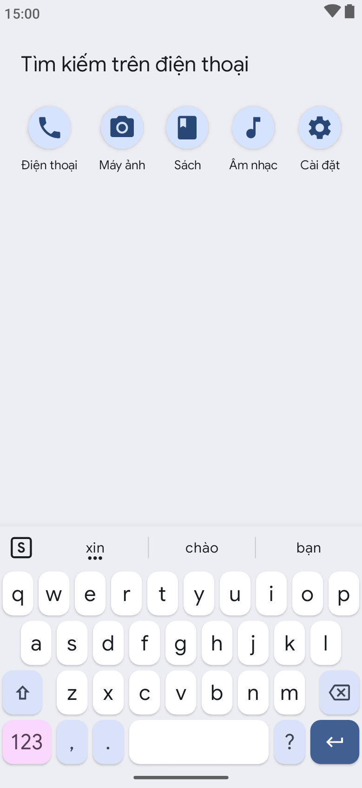
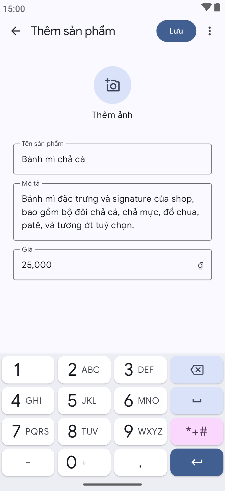
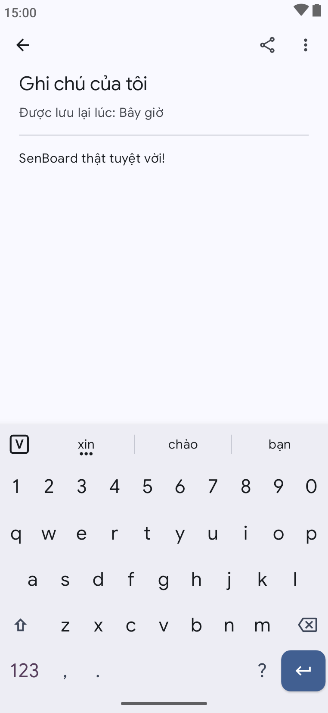
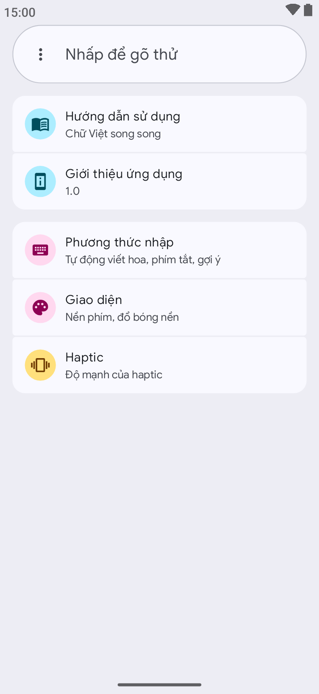
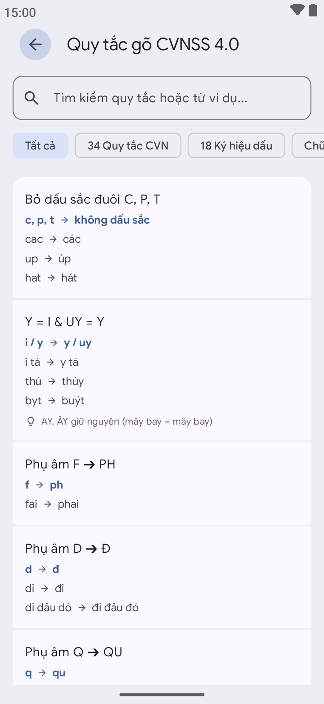
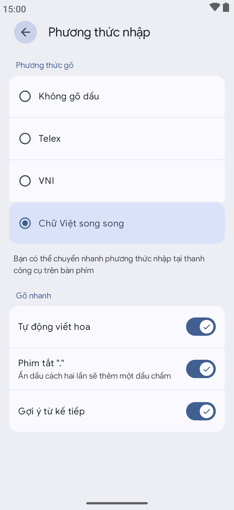
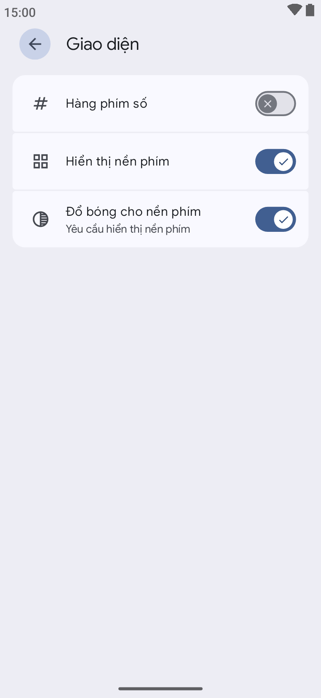
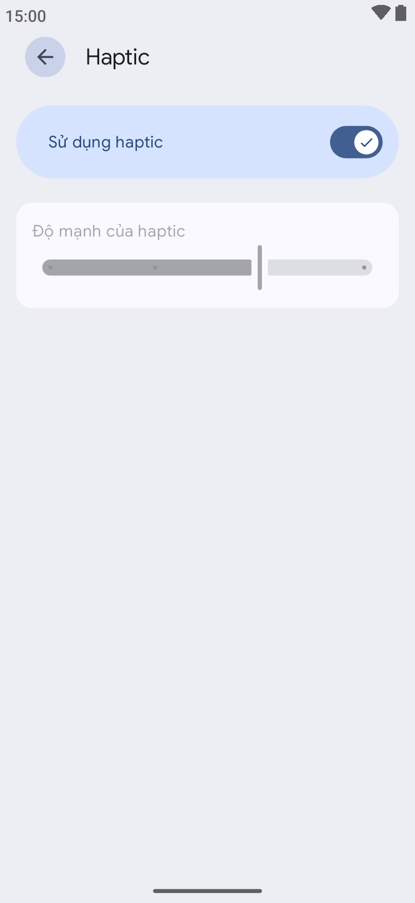

# SenBoard

[Tiếng Việt](README.md) | [English](README-en.md)

Ứng dụng bàn phím gõ Tiếng Việt dành cho hệ điều hành Android. Hỗ trợ các tính năng cơ bản như gõ
dấu, tự động viết hoa, gợi ý từ tiếp theo, và phím tắt ".".

Hiện tại ứng dụng hỗ trợ hai bộ gõ thông dụng: Telex và VNI.

Ngoài ra, ứng dụng còn hỗ trợ một bộ gõ Tiếng Việt nhanh dựa trên giáo
trình [Chữ Việt Song Song 4.0](https://chuvietnhanh.sourceforge.net/ChuVNSongSong.htm).

> [!NOTE]
> Ứng dụng vẫn đang nằm trong giai đoạn phát triển sớm, nên sẽ xuất hiện một số bug trong quá trình
> sử dụng!

## Ảnh chụp màn hình

  
Hiện/ẩn ảnh chụp màn hình

  
  
  
  
  
  
  
  

## Thông tin sử dụng AI trong quá trình phát triển

Ứng dụng được phát triển đồng thời với sự hỗ trợ của mô hình dữ liệu lớn (Large Language Model -
LLM). Trong đó:

- Các mô hình được sử dụng: GPT 5.6 Sol, Gemini 3.1 Flash
- Công cụ sử dụng: ChatGPT Web, Antigravity, Android Studio

## Giấy phép

[Apache-2.0](LICENSE)
